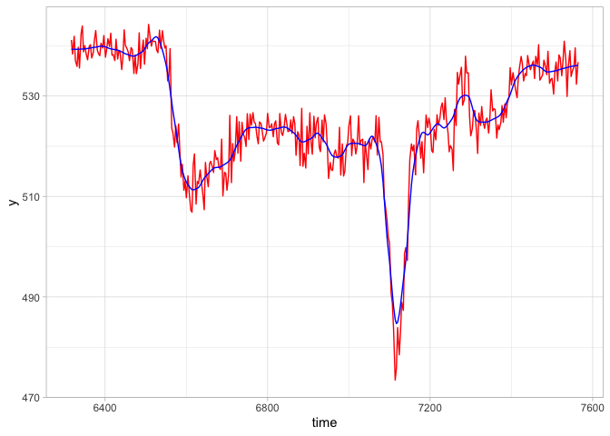
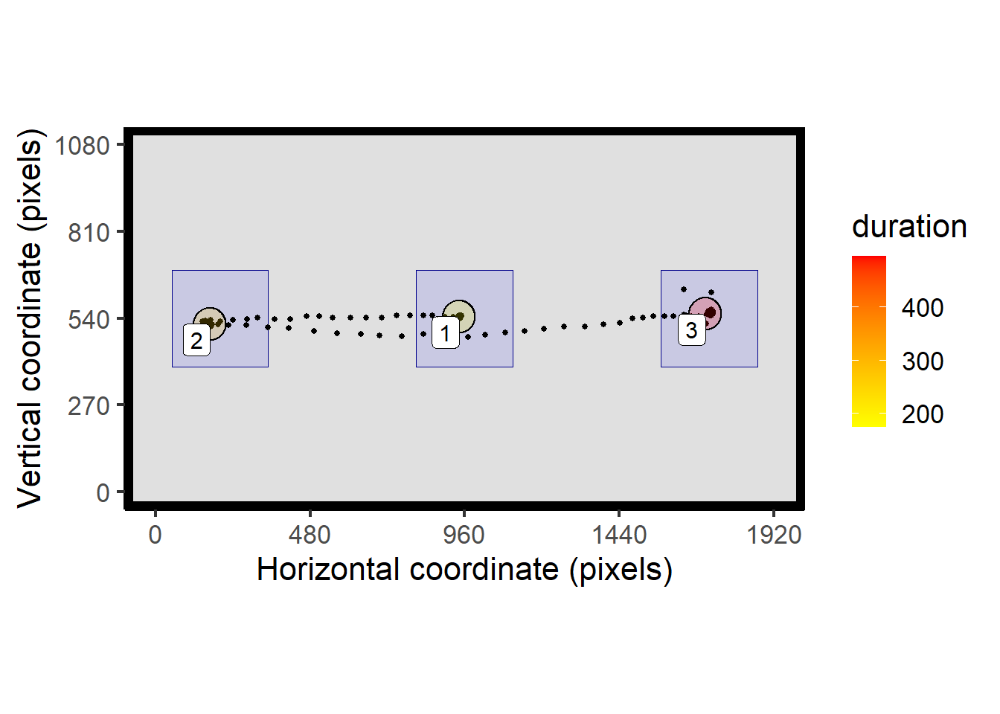
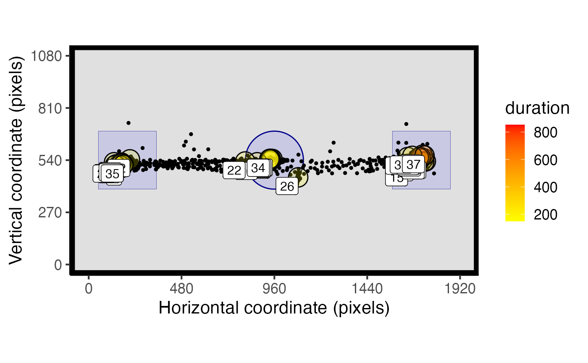
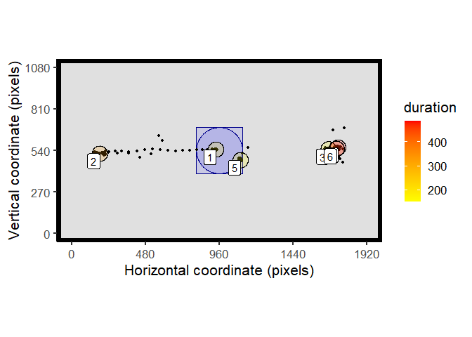
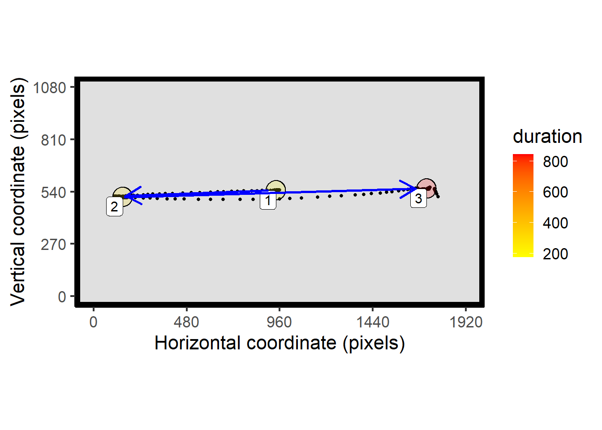

<!-- badges: start -->

<!-- badges: end -->

# **eyetools**

## A set of tools for eye data processing, analysis and visualisation in R

**eyetools** is a package that provides a set of simple tools that will
facilitate common steps in the processing and analysis of eye data. It
is intended for use with data from psychological experiments. The idea
is to have a workflow which is aided by these functions, going from
processing of the raw data, to extraction of event related data (i.e.,
fixations, saccades), to summarising those data at the trial level
(e.g., time on areas of interest).

**Warning - still in experimental form! Please check results carefully**

to install: `devtools::install_github("tombeesley/eyetools")`

It is free to use under the GNU General Public Licence..

“Roadmap” for functions:

<table>
<colgroup>
<col style="width: 25%" />
<col style="width: 25%" />
<col style="width: 25%" />
<col style="width: 25%" />
</colgroup>
<thead>
<tr class="header">
<th>order</th>
<th>process</th>
<th>implemented function(s)</th>
<th>comment</th>
</tr>
</thead>
<tbody>
<tr class="odd">
<td>1.</td>
<td>combine binocular data</td>
<td><code>combine_eyes()</code></td>
<td>works: either average or “best eye”</td>
</tr>
<tr class="even">
<td>2.</td>
<td>interpolation</td>
<td><code>interpolate()</code></td>
<td>working and provides a summary report of repair</td>
</tr>
<tr class="odd">
<td>3.</td>
<td>smoothing</td>
<td><code>smoother()</code></td>
<td>working</td>
</tr>
<tr class="even">
<td>4.</td>
<td>dispersion-based fixations</td>
<td><code>fix_dispersion()</code></td>
<td>working and pretty fast - needs thorough checking</td>
</tr>
<tr class="odd">
<td>5.</td>
<td>area of interest analysis</td>
<td><code>AOI_time()</code></td>
<td>working with both rectangular and circular AOIs</td>
</tr>
<tr class="even">
<td>6.</td>
<td>Visualisations - heatmaps, fixation plots, etc</td>
<td><code>spatial_plot()</code></td>
<td>provides a 2D plot of raw data, fixations and AOIs</td>
</tr>
<tr class="odd">
<td>7.</td>
<td>Saccade detection</td>
<td><code>VTI_saccade()</code></td>
<td>Working in basic form - provides summary of velocity, start/end,
duration, etc</td>
</tr>
<tr class="even">
<td>8.</td>
<td>velocity-based fixations</td>
<td></td>
<td></td>
</tr>
<tr class="odd">
<td>9.</td>
<td>scan paths …</td>
<td></td>
<td></td>
</tr>
</tbody>
</table>

## How to use eyetools (work in progress)

### Installation

You can install eyetools using the following code:

    if (!require(devtools)) {
      install.packages("devtools")
      library(devtools)
    }
    install_github("tombeesley/eyetools")

and then load it:

    library(eyetools)

### The format of raw data

Data needs to be in a particular format to be compatible with the
functions in eyetools. This format is 4 columns of data, with each row
representing a sample. The four columns are: time, x, y, and trial. You
can see an example with the built in data sets:

    example_raw_sac

    ## # A tibble: 32,608 × 4
    ##     time     x     y trial
    ##    <dbl> <dbl> <dbl> <dbl>
    ##  1     0  940.  535.     1
    ##  2     3  940.  536.     1
    ##  3     7  936.  533.     1
    ##  4    10  939.  536.     1
    ##  5    13  944.  533.     1
    ##  6    17  939.  535.     1
    ##  7    20  938.  531.     1
    ##  8    23  939.  536.     1
    ##  9    27  940.  534.     1
    ## 10    30  942.  537.     1
    ## # … with 32,598 more rows

**Importantly**, the data for each trial should be sequential and
logical, that is, the timestamps should run continuously, without any
gaps in the recording process. The eyetools package expects data to
contain only data for a single participant; none of the functions handle
the data for multiple participants in their present state.

### Repairing data

Raw data will often contain missing samples, which we can attempt to
repair. eyetools has an `interpolation()` function you can use to do
this. It will produce a report of how successful the repair was in terms
of the missing data before and after interpolation:

    eyetools::interpolate(example_raw_sac, report = TRUE)

    ## [[1]]
    ## # A tibble: 32,608 × 4
    ##     time     x     y trial
    ##    <dbl> <dbl> <dbl> <dbl>
    ##  1     0  940.  535.     1
    ##  2     3  940.  536.     1
    ##  3     7  936.  533.     1
    ##  4    10  939.  536.     1
    ##  5    13  944.  533.     1
    ##  6    17  939.  535.     1
    ##  7    20  938.  531.     1
    ##  8    23  939.  536.     1
    ##  9    27  940.  534.     1
    ## 10    30  942.  537.     1
    ## # … with 32,598 more rows
    ## 
    ## [[2]]
    ## # A tibble: 1 × 2
    ##   missing_perc_before missing_perc_after
    ##                 <dbl>              <dbl>
    ## 1              0.0998             0.0952

    raw_data <- eyetools::interpolate(example_raw_sac) # store as new object

We can also apply a smoothing function (`smoother()`) over the data,
which is particularly important for the analysis of saccadic velocities.

    smooth_data <- eyetools::smoother(example_raw_sac) 

    library(tidyverse)

    r <- filter(raw_data, trial == 2)
    s <- filter(smooth_data, trial == 2)

    ggplot() +
      geom_line(data = r, 
                aes(x = time, y = y),
                colour = "red") +
      geom_line(data = s, 
                aes(x = time, y = y),
                colour = "blue")

### Processing fixations

The function `fix_dispersion()` is a dispersion-based algorithm for
identifying fixations, based on the algorithm described in Salvucci and
Goldberg (2000). Passing raw data to this will return a data frame with
the fixations ordered by trial and by fixation sequence, with the
averaged x and y coordinates, timestamps and duration. The “min\_dur”
parameter will restrict to fixations over a certain duration. The
“disp\_tol” parameter sets the tolerance for the dispersion of data
within a fixation. Exploratory analysis of the data will be needed to
find suitable values for these.

    raw_data_f <- filter(raw_data, trial <= 3) # get a sample of trials

    fix_dispersion(raw_data_f, min_dur = 120, disp_tol = 100)

    ##    trial fix_n start  end duration    x   y prop_NA min_dur disp_tol
    ## 1      1     1     0  230      230  937 535   0.000     120      100
    ## 2      1     2   273  460      187  170 500   0.000     120      100
    ## 3      1     3   643 1180      537 1743 534   0.000     120      100
    ## 4      1     4  1306 1426      120  252 503   0.243     120      100
    ## 5      1     5  1536 1656      120  131 530   0.243     120      100
    ## 6      1     6  1660 1816      156  135 533   0.000     120      100
    ## 7      2     1     0  230      230  938 539   0.000     120      100
    ## 8      2     2   273  407      134  201 515   0.000     120      100
    ## 9      2     3   410  767      357  143 522   0.000     120      100
    ## 10     2     4   940 1070      130 1696 527   0.000     120      100
    ## 11     2     5  1073 1247      174 1739 535   0.000     120      100
    ## 12     3     1     0  167      167  941 543   0.000     120      100
    ## 13     3     2   210  533      323  159 521   0.000     120      100
    ## 14     3     3   623  743      120 1673 519   0.243     120      100
    ## 15     3     4   747 1097      350 1732 547   0.000     120      100
    ## 16     3     5  1187 1307      120  211 543   0.243     120      100

### Plotting data

The function `spatial_plot()` is a wrapper for a series of ggplot
commands to plot both raw data and fixation summaries.

    library(patchwork)
    # patchwork is used here to plot adjacent figures

    t_raw <- filter(example_raw_sac, trial == 9)

    # process fixations
    t_fix <- fix_dispersion(t_raw, disp_tol = 100, min_dur = 150)

    raw_plot <- spatial_plot(raw_data = t_raw, plot_header = TRUE)
    fix_plot <- spatial_plot(raw_data = t_raw, fix_data = t_fix)

    raw_plot/fix_plot # combined plot with patchwork

### Assessing time on areas of interest

The function `AOI_time()` can be used to calculate the time spent on
areas of interest. Areas of interest need to be defined by the x and y
centre points, and the width and height in pixels:

    AOI_regions <- data.frame(matrix(nrow = 3, ncol = 4))
    colnames(AOI_regions) <- c("x", "y", "width_radius", "height")

    AOI_regions[1,] <- c(960, 540, 300, 300) # X, Y, W, H - square
    AOI_regions[2,] <- c(200, 540, 300, 300) # X, Y, W, H - square
    AOI_regions[3,] <- c(1720, 540, 300, 300) # X, Y, W, H - square

`AOI_time()` uses the fixation data as input to the function. In this
example we are finding the time spent in 3 rectangular regions across
the first 10 trials:

    t_raw <- filter(example_raw_sac, between(trial,1,10))

    # process fixations
    t_fix <- fix_dispersion(t_raw, disp_tol = 100, min_dur = 150)

    AOI_time(t_fix, AOIs = AOI_regions)

    ##    trial AOI_1 AOI_2 AOI_3
    ## 1      1   230   337   537
    ## 2      2   230   487   304
    ## 3      3   167   473   477
    ## 4      4   283   370   349
    ## 5      5   246   360   363
    ## 6      6   200   217     0
    ## 7      7   150   337   797
    ## 8      8   180   346   853
    ## 9      9   174   260   496
    ## 10    10   197   150   826

We can include the AOIs within our `spatial_plot()`:

    t_raw <- filter(example_raw_sac, trial == 9) # single trial for plotting purposes

    # process fixations
    t_fix <- fix_dispersion(t_raw, disp_tol = 100, min_dur = 150)

    spatial_plot(raw_data = t_raw, fix_data = t_fix, AOIs = AOI_regions)

We can also define AOIs as circles by specifying the radius in the 3rd
column and setting the 4th column to NA:

    AOI_regions <- data.frame(matrix(nrow = 3, ncol = 4))
    colnames(AOI_regions) <- c("x", "y", "width_radius", "height")

    AOI_regions[1,] <- c(960, 540, 150, NA) # X, Y, R - circle
    AOI_regions[2,] <- c(200, 540, 300, 300) # X, Y, W, H - square
    AOI_regions[3,] <- c(1720, 540, 300, 300) # X, Y, W, H - square

    t_raw <- filter(example_raw_sac, between(trial,1,10))

    # process fixations
    t_fix <- fix_dispersion(t_raw, disp_tol = 100, min_dur = 150)

    spatial_plot(raw_data = t_raw, fix_data = t_fix, AOIs = AOI_regions)

Circular AOIs are also handled by AOI\_time and will produce different
results to comparable rectangular AOIs. Here fixation 5 falls outside of
the circular AOI, but within the region of the rectangular AOI:

    AOI_regions <- data.frame(matrix(nrow = 2, ncol = 4))
    colnames(AOI_regions) <- c("x", "y", "width_radius", "height")

    AOI_regions[1,] <- c(960, 540, 150, NA) # X, Y, R - circle in centre
    AOI_regions[2,] <- c(960, 540, 300, 300) # X, Y, W, H - square in centre

    t_raw <- filter(example_raw_sac, trial == 13)

    # process fixations
    t_fix <- fix_dispersion(t_raw, disp_tol = 100, min_dur = 150)

    spatial_plot(raw_data = t_raw, fix_data = t_fix, AOIs = AOI_regions)

    AOI_time(t_fix, AOIs = AOI_regions)

    ##    trial AOI_1 AOI_2
    ## 13    13   180   330

### Processing saccades

The function `VTI_saccade()` provides a means of processing the data for
saccades, based on a “velocity threshold identification” algorithm, as
described in Salvucci and Goldberg (2000). As described above, it is
wise to use the `smoother()` function on the data first. THe sample rate
can be set if known, or can be approximated using the timestamps in the
data. The threshold determines the degrees of visual angle per second
needed to indicate the presence of a saccadic eye-movement.

    t_raw <- filter(example_raw_sac, between(trial,1,10))

    t_smooth <- smoother(t_raw)

    VTI_saccade(t_smooth, sample_rate = 300)

    ##    trialNumber sac_n start  end duration  origin_x origin_y terminal_x
    ## 1            1     1   223  287       64  870.3588 527.6547   177.1630
    ## 2            1     2   447  530       83  209.4739 500.0963  1423.6778
    ## 3            2     1   230  280       50  843.5225 537.3153   258.2328
    ## 4            2     2   757  840       83  184.2432 518.7122  1513.4706
    ## 5            3     1   163  217       54  864.0695 538.9868   188.6405
    ## 6            3     2   527  550       23  236.2502 533.8763   456.4131
    ## 7            3     3  1087 1120       33 1671.8701 542.0387  1278.9085
    ## 8            4     1   280  340       60  941.2610 525.2997   167.3127
    ## 9            4     2   696  730       34  193.3663 514.7454   638.2664
    ## 10           5     1   240  293       53  989.2586 539.9973  1655.2936
    ## 11           5     2   646  690       44 1688.9012 545.7763  1023.0553
    ## 12           6     1   197  247       50  828.6306 532.1597   194.2109
    ## 13           6     2   590  627       37  189.2387 524.2148   865.8235
    ## 14           7     1   174  224       50  746.4592 532.5643   238.6413
    ## 15           8     1   174  237       63  869.1958 545.3931   205.9854
    ## 16           8     2   564  664      100  162.7739 512.4705  1644.4917
    ## 17           9     1   170  227       57  880.2617 546.0806   205.5746
    ## 18           9     2   474  564       90  216.2176 517.2547  1621.2220
    ## 19          10     1   194  254       60  845.9267 539.5713   226.3948
    ## 20          10     2   530  624       94  180.4137 519.7535  1595.2826
    ##    terminal_y mean_velocity peak_velocity
    ## 1    494.6964      272.5147      467.6514
    ## 2    481.3370      362.4432      625.5313
    ## 3    513.4092      288.7795      438.2568
    ## 4    514.5291      395.9804      681.8466
    ## 5    517.6894      311.9050      487.7608
    ## 6    571.9000      237.5178      343.4771
    ## 7    558.7318      289.8878      429.8076
    ## 8    517.7416      321.6201      504.1717
    ## 9    545.7368      322.5088      550.1424
    ## 10   541.0273      310.0758      476.9325
    ## 11   527.7667      373.8080      574.9975
    ## 12   524.7652      314.3620      462.7681
    ## 13   511.5511      446.6401      654.1694
    ## 14   526.0246      251.9393      359.9658
    ## 15   520.0820      263.1169      421.9078
    ## 16   553.6281      370.0669      675.9970
    ## 17   532.1546      294.4052      473.1296
    ## 18   545.1010      390.8524      664.2136
    ## 19   524.6715      258.9834      400.2764
    ## 20   557.3451      377.0585      673.8068

Saccadic eye movements can be plotted alongside other data using the
`spatial_plot()` function:

    t_smooth <- filter(t_smooth, trial == 8)

    t_fix <- fix_dispersion(t_smooth, disp_tol = 100, min_dur = 150)

    t_sac <- VTI_saccade(t_smooth, sample_rate = 300, threshold = 100)

    spatial_plot(raw_data = t_smooth, fix_data = t_fix, sac_data = t_sac)

