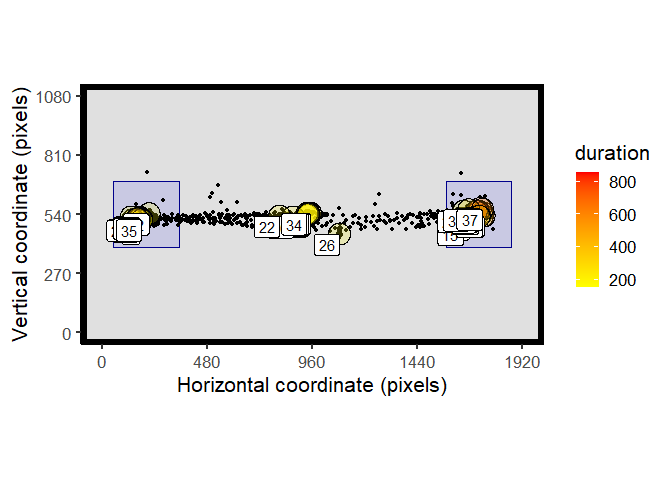

# **eyetools**

## A set of tools for eye data processing, analysis and visualisation in R

**eyetools** is a package that provides a set of simple tools that will
facilitate common steps in the processing and analysis of eye data. It
is intended for use with data from psychological experiments. The idea
is to have a workflow which is aided by these functions, going from
processing of the raw data, to extraction of event related data (i.e.,
fixations, saccades), to summarising those data at the trial level
(e.g., time on areas of interest).

**Warning - still in experimental form! Please check results carefully**

to install: `devtools::install_github("tombeesley/eyetools")`

It is free to use under the GNU General Public Licence..

“Roadmap” for functions:

| order | process                                        | implemented function(s) | comment                                                                        |
|-------|------------------------------------------------|-------------------------|--------------------------------------------------------------------------------|
| 1\.   | combine binocular data                         | `combine_eyes()`        | works: either average or “best eye”                                            |
| 2\.   | interpolation                                  | `interpolate()`         | working and provides a summary report of repair                                |
| 3\.   | smoothing                                      | `smoother()`            | working                                                                        |
| 4\.   | dispersion-based fixations                     | `fix_dispersion()`      | working and pretty fast - needs thorough checking                              |
| 5\.   | area of interest analysis                      | `AOI_time()`            | working in basic form - needs thorough checking                                |
| 6\.   | Visualisations - heatmaps, fixation plots, etc | `spatial_plot()`        | provides a 2D plot of raw data and fixations                                   |
| 7\.   | Saccade detection                              | `VTI_saccade()`         | Working in basic form - provides summary of velocity, start/end, duration, etc |
| 8\.   | velocity-based fixations                       |                         |                                                                                |
| 9\.   | scan paths?                                    |                         |                                                                                |

## How to use eyetools (work in progress)

**Installation**

You can install eyetools using the following code:

``` r
if (!require(devtools)) {
  install.packages("devtools")
  library(devtools)
}
install_github("tombeesley/eyetools")
```

and then load it:

``` r
library(eyetools)
```

**The format of raw data**

Data needs to be in a particular format to be compatible with the
functions in eyetools. This format is 4 columns of data, with each row
representing a sample. The four columns are: time, x, y, and trial. You
can see an example with the built in data sets:

``` r
example_raw_sac
```

    ## # A tibble: 32,608 x 4
    ##     time     x     y trial
    ##    <dbl> <dbl> <dbl> <dbl>
    ##  1     0  940.  535.     1
    ##  2     3  940.  536.     1
    ##  3     7  936.  533.     1
    ##  4    10  939.  536.     1
    ##  5    13  944.  533.     1
    ##  6    17  939.  535.     1
    ##  7    20  938.  531.     1
    ##  8    23  939.  536.     1
    ##  9    27  940.  534.     1
    ## 10    30  942.  537.     1
    ## # ... with 32,598 more rows

**Repairing data**

Raw data will often contain missing samples, which we can attempt to
repair. eyetools has an `interpolation()` function you can use to do
this. It will produce a report of how succesful the repair was in terms
of the missing data before and after interpolation:

``` r
eyetools::interpolate(example_raw_sac, report = TRUE)
```

    ## [[1]]
    ## # A tibble: 32,608 x 4
    ##     time     x     y trial
    ##    <dbl> <dbl> <dbl> <dbl>
    ##  1     0  940.  535.     1
    ##  2     3  940.  536.     1
    ##  3     7  936.  533.     1
    ##  4    10  939.  536.     1
    ##  5    13  944.  533.     1
    ##  6    17  939.  535.     1
    ##  7    20  938.  531.     1
    ##  8    23  939.  536.     1
    ##  9    27  940.  534.     1
    ## 10    30  942.  537.     1
    ## # ... with 32,598 more rows
    ## 
    ## [[2]]
    ## # A tibble: 1 x 2
    ##   missing_perc_before missing_perc_after
    ##                 <dbl>              <dbl>
    ## 1              0.0998             0.0952

``` r
raw_data <- eyetools::interpolate(example_raw_sac) # store as new object
```

We can also apply a smoothing function (`smoother()`) over the data,
which is particularly important for the analysis of saccadic velocities.

``` r
smooth_data <- eyetools::smoother(example_raw_sac) 
```

``` r
library(tidyverse)

r <- filter(raw_data, trial == 2)
s <- filter(smooth_data, trial == 2)

ggplot() +
  geom_line(data = r, 
            aes(x = time, y = y),
            colour = "red") +
  geom_line(data = s, 
            aes(x = time, y = y),
            colour = "blue")
```

<!-- -->

**Processing fixations**

The function `fix_dispersion()` is a dispersion-based algorithm for
identifying fixations, based on the algorithm described in Salvucci and
Goldberg (2000). Passing raw data to this will return a data frame with
the fixations ordered by trial and by fixation sequence, with the
averaged x and y coordinates, timestamps and duration. The “min_dur”
parameter will restrict to fixations over a certain duration. The
“disp_tol” parameter sets the tolerance for the dispersion of data
within a fixation. Exploratory analysis of the data will be needed to
find suitable values for these.

``` r
raw_data_f <- filter(raw_data, trial <= 3) # get a sample of trials

fix_dispersion(raw_data_f, min_dur = 120, disp_tol = 100)
```

    ##    trial fix_n start  end duration    x   y prop_NA min_dur disp_tol
    ## 1      1     1     0  230      230  937 535   0.000     120      100
    ## 2      1     2   273  460      187  170 500   0.000     120      100
    ## 3      1     3   643 1180      537 1743 534   0.000     120      100
    ## 4      1     4  1306 1426      120  252 503   0.243     120      100
    ## 5      1     5  1536 1656      120  131 530   0.243     120      100
    ## 6      1     6  1660 1816      156  135 533   0.000     120      100
    ## 7      2     1     0  230      230  938 539   0.000     120      100
    ## 8      2     2   273  407      134  201 515   0.000     120      100
    ## 9      2     3   410  767      357  143 522   0.000     120      100
    ## 10     2     4   940 1070      130 1696 527   0.000     120      100
    ## 11     2     5  1073 1247      174 1739 535   0.000     120      100
    ## 12     3     1     0  167      167  941 543   0.000     120      100
    ## 13     3     2   210  533      323  159 521   0.000     120      100
    ## 14     3     3   623  743      120 1673 519   0.243     120      100
    ## 15     3     4   747 1097      350 1732 547   0.000     120      100
    ## 16     3     5  1187 1307      120  211 543   0.243     120      100

**Plotting data**

The function `spatial_plot()` is a wrapper for a series of ggplot
commands to plot both raw data and fixation summaries.

``` r
library(patchwork)
# patchwork is used here to plot adjacent figures

t_raw <- filter(example_raw_sac, trial == 9)

# process fixations
t_fix <- fix_dispersion(t_raw, disp_tol = 100, min_dur = 150)

raw_plot <- spatial_plot(raw_data = t_raw, plot_header = TRUE)
fix_plot <- spatial_plot(raw_data = t_raw, fix_data = t_fix)

raw_plot/fix_plot # combined plot with patchwork
```

<!-- -->

**Assessing time on areas of interest**

The function `AOI_time()` can be used to calculate the time spent on
areas of interest. Areas of interest need to be defined by the x and y
centre points, and the width and height in pixels:

``` r
AOI_regions <- data.frame(matrix(nrow = 3, ncol = 4))
colnames(AOI_regions) <- c("x", "y", "width", "height")

AOI_regions[1,] <- c(960, 540, 300, 300) # X, Y, W, H - square
AOI_regions[2,] <- c(200, 540, 300, 300) # X, Y, W, H - square
AOI_regions[3,] <- c(1720, 540, 300, 300) # X, Y, W, H - square
```

`AOI_time()` uses the fixation data as input to the function. In this
example we are finding the time spent in 3 rectangular regions across
the first 10 trials:

``` r
t_raw <- filter(example_raw_sac, between(trial,1,10))

# process fixations
t_fix <- fix_dispersion(t_raw, disp_tol = 100, min_dur = 150)

AOI_time(t_fix, AOIs = AOI_regions)
```

    ##    trial AOI_1 AOI_2 AOI_3
    ## 1      1   230   337   537
    ## 2      2   230   487   304
    ## 3      3   167   473   477
    ## 4      4   283   370   349
    ## 5      5   246   360   363
    ## 6      6   200   217     0
    ## 7      7   150   337   797
    ## 8      8   180   346   853
    ## 9      9   174   260   496
    ## 10    10   197   150   826

We can include the AOIs within our `spatial_plot()`:

``` r
t_raw <- filter(example_raw_sac, trial == 9) # single trial for plotting purposes

# process fixations
t_fix <- fix_dispersion(t_raw, disp_tol = 100, min_dur = 150)

spatial_plot(raw_data = t_raw, fix_data = t_fix, AOIs = AOI_regions)
```

<!-- -->

circle AOIs?

``` r
AOI_regions <- data.frame(matrix(nrow = 3, ncol = 4))
colnames(AOI_regions) <- c("x", "y", "width", "height")

AOI_regions[1,] <- c(960, 540, 300, NA) # X, Y, W, H - square
AOI_regions[2,] <- c(200, 540, 300, 300) # X, Y, W, H - square
AOI_regions[3,] <- c(1720, 540, 300, 300) # X, Y, W, H - square

t_raw <- filter(example_raw_sac, between(trial,1,10))

# process fixations
t_fix <- fix_dispersion(t_raw, disp_tol = 100, min_dur = 150)

AOI_time(t_fix, AOIs = AOI_regions)
```

    ##    trial AOI_1 AOI_2 AOI_3
    ## 1      1   230   337   537
    ## 2      2   230   487   304
    ## 3      3   167   473   477
    ## 4      4   283   370   349
    ## 5      5   246   360   363
    ## 6      6   200   217     0
    ## 7      7     0   337   797
    ## 8      8   180   346   853
    ## 9      9   174   260   496
    ## 10    10   197   150   826

``` r
spatial_plot(raw_data = t_raw, fix_data = t_fix, AOIs = AOI_regions)
```

<!-- -->

**Processing saccades**

Example of `VTI_saccade()`
