# An introduction to eyetools

The eyetools package is designed to provide a consistent set of
functions that helps researchers perform straightforward, yet powerful,
steps in the analysis of eye-data. The suite of functions will allow the
user to go from relatively unprocessed data to trial level summaries
that are ready for statistical analysis.

You can install eyetools using the following code:

``` r

install.packages('eyetools')
```

A quick note before starting: the following tutorial is written using
only the dependencies contained within eyetools, so that means that if
you are planning on following this tutorial through, you only need to
install eyetools.

``` r

library(eyetools)
```

    ## Successfully loaded eyetools version 0.9.3
    ##  If you use this package, we would love to hear from you: t.beesley@lancaster.ac.uk
    ##  See NEWS for details of all changes.

## Specifying eye-tracker properties

To ensure accurate computation within eyetools, it is important for
users to specify the properties of the data and the recording device.
This can be done using the function
[`tracker_properties_set()`](https://tombeesley.github.io/eyetools/reference/tracker_properties_set.md).
Calling this without arguments will provide a list of the parameters
that can be specified:

``` r

tracker_properties_set()
```

    ## Available parameters you can change:

    ## [1] "sample_frequency"     "viewing_distance_cm"  "screen_width_cm"     
    ## [4] "screen_height_cm"     "screen_width_pixels"  "screen_height_pixels"

For example, we can set the sampling frequency:

``` r

tracker_properties_set(sample_frequency = 300)
```

This overides the default value, which is purposefully left NULL. If a
function detects a NULL sampling frequency it will estimate the sampling
frequency from the timestamps in the data. The current tracker
properties can be revealed using:

``` r

tracker_properties_get()
```

    ## $sample_frequency
    ## [1] 300
    ## 
    ## $viewing_distance_cm
    ## [1] 60
    ## 
    ## $screen_width_cm
    ## [1] 53
    ## 
    ## $screen_height_cm
    ## [1] 30
    ## 
    ## $screen_width_pixels
    ## [1] 1920
    ## 
    ## $screen_height_pixels
    ## [1] 1080

## Data Manipulation and Preprocessing

Eyetools has built in example data that can be used while getting to
grips with the package. For the purpose of this tutorial, we will start
with a small dataset that contains binocular eye data from two
participants (and six trials) from a simple contingency learning task
(the data are from Beesley, Nguyen, Pearson, & Le Pelley, 2015)[^1]. In
this task there are two stimuli that appear simultaneously on each trial
(to the left and right in the top half of the screen). Participants look
at these cues and then make a decision by selecting an “outcome
response” button.

[](https://journals.sagepub.com/doi/10.1080/17470218.2015.1009919)

Let’s load in this binocular data and explore the format. As we can see,
the dataset is formed of 31,041 rows and 7 variables

``` r

data(HCL, package = "eyetools")

dim(HCL)
```

    ## [1] 31041     7

To get a basic idea of the contents of the data, we can look at the
first 10 observations in the data

We can see that our seven variables contain the participant identifier
(`pID`), the timepoint of the trial (`time`), the left eye x and y
coordinates (`left_x` and `left_y`), the right eye coordinates
(`right_x` and `right_y`), as well as a trial identifier (`trial`).

By default eyetools assumes that the resolution of eye data is in pixels
(and a default screen size of 1920x1080), however the functions should
work with any units (with no guarantee as it is not tested with units
other than pixels).

``` r

head(HCL, 10)
```

    ##    pID time   left_x   left_y   right_x  right_y trial
    ## 1  118    0 908.6354 825.5366 1003.0812 807.5926     1
    ## 2  118    3 912.1100 828.8806 1000.9256 812.3637     1
    ## 3  118    7 911.5480 826.4333 1009.9286 813.0900     1
    ## 4  118   10 907.8889 823.8142 1006.0566 806.8520     1
    ## 5  118   13 911.9879 823.5715 1005.2550 804.5915     1
    ## 6  118   17 912.2458 826.3770  999.7613 801.9357     1
    ## 7  118   20 909.8344 825.6048  996.6499 805.5704     1
    ## 8  118   23 912.3329 824.7951 1004.6580 806.1265     1
    ## 9  118   27 911.0252 819.2719 1006.4573 807.7407     1
    ## 10 118   30 913.6681 821.2920 1012.9939 803.9613     1

eyetools functions can accept either single-participant data or
multi-participant data. By default, most functions assume that data is
of a single participant **unless** a participant identifier column
called `participant_col` is present,in which case the data is handled as
multi-participant. In cases where participants are identified with a
different variable, functions accept a parameter of `participant_col`
that takes a character string of the identifying column. In situations
where participant_col is not declared, and when duplicated
non-consecutive trials are detected (that implies multi-participant data
being input as single-participant), the function will error. This is a
good point to then check your data structure, ensure that it is labelled
correctly and ordered by trial and time.

### Converting binocular data to monocular data

We need to combine the left and right eye x and y coordinates to get a
single pair of \[x,y\] coordinates for each timepoint. The eyetools
function
[`combine_eyes()`](https://tombeesley.github.io/eyetools/reference/combine_eyes.md)
can do this for us. The `method` parameter gives the option to either
“average” the two eyes, or we can use the “best_eye”. For “average”, the
result is based on the average of the two eyes for each sample, or for
samples where there is data from only a single eye, that eye is used.
For “best_eye”, a summary of the proportion of missing samples is
computed, and the eye with the fewest missing samples is used. Here we
use the default parameter “average”.

[`combine_eyes()`](https://tombeesley.github.io/eyetools/reference/combine_eyes.md)
is one of the few core eyetools functions that doesn’t handle
multi-participant/single-participant data differently. Primarily because
of the function’s construction and its intended useage, it does not need
to do so.

``` r

data <- combine_eyes(HCL)
```

The above code returns a flattened list of all participants data, and if
we take a look at just one participant, we are returned with a dataframe
that has x and y variables in place of the left\_\* and right\_\*
variables. This is the data format needed by many of the other eyetools
functions: time, x, y, and trial. The ordering of the variables should
not matter, however most of the functions will impose an ordering in how
the information is returned.

``` r

head(data) # participant 118
```

    ##   pID time trial        x        y
    ## 1 118    0     1 955.8583 816.5646
    ## 2 118    3     1 956.5178 820.6221
    ## 3 118    7     1 960.7383 819.7616
    ## 4 118   10     1 956.9727 815.3331
    ## 5 118   13     1 958.6214 814.0815
    ## 6 118   17     1 956.0035 814.1564

### Fixing missing data and repairing data

The next stage of the process would be to remove missing data within
continuous streams of eye data which are likely to be caused by
blinking. We can do this using the
[`interpolate()`](https://tombeesley.github.io/eyetools/reference/interpolate.md)
function. The maxgap parameter specifies the maximum time frame of
consecutive NAs to fill. Any longer gaps will be left unchanged. This is
set as default to 150, the typical duration of a blink. The method
parameter can either be “approx” (default) or “spline” which are both
calls to [`zoo::na.approx`](https://rdrr.io/pkg/zoo/man/na.approx.html)
and [`zoo::na.spline`](https://rdrr.io/pkg/zoo/man/na.approx.html)
respectively.

Note that as the participant identifier column is not “participant_col”
(as eyetools expects as default), it needs to be specified in the
function call.

``` r

data <- interpolate(data, maxgap = 150, method = "approx")
```

You can also request a report of the differences in NA values present
before and after the interpolation as well

``` r

interpolate_report <- interpolate(data, maxgap = 150, method = "approx", report = TRUE)

interpolate_report[[2]]
```

    ##   pID missing_perc_before missing_perc_after
    ## 1 118         0.018152889        0.018152889
    ## 2 119         0.009875683        0.009875683

An additional step that can be beneficial is to pass the eye data
through the
[`smoother()`](https://tombeesley.github.io/eyetools/reference/smoother.md)
function. This removes particularly jerky transitions between samples
and is critical for the analysis of velocities in the eye-movements. For
now, let’s store the smoothed data in a new object. We can also ask for
a plot of the data so that we can visually inspect it to see how well it
fits the data.

``` r

set.seed(0410) #set seed to show same participant and trials in both chunks

data_smooth <- smoother(data,
                        span = .1, # default setting. This controls the degree of smoothing
                        plot = TRUE) # whether to plot or not, FALSE as default
```

    ## Showing trials: 4, 6 for participant 119

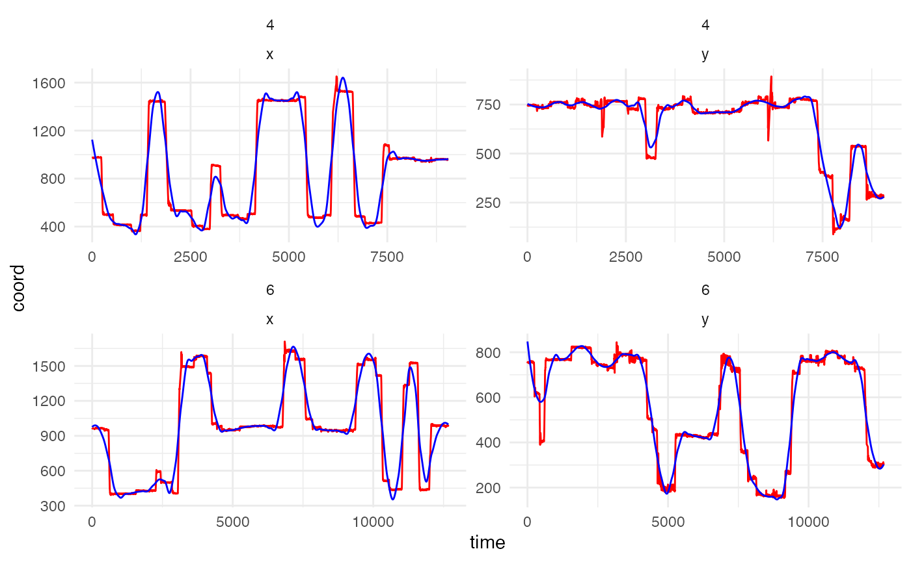

The plot above shows the difference between the raw and smoothed data
for a randomly selected participant and two random trials (simply for
visualisation purposes and to keep the amount of plotting to a minimum).

With the default smoothing setting, we can see that the smoothed data
does not track the actual data as closely as it could. The lower the
value of `span`, the closer the smoothed data represents the raw data. A
visual inspection of the plot suggests that a span of .02 is a good
value for this data example. It is important that the fixations and
saccades are matched closely to ensure data quality. Oversmooth and you
end up with significant data loss, undersmooth and all the jerky eye
movement is preserved rendering the use of
[`smoother()`](https://tombeesley.github.io/eyetools/reference/smoother.md)
meaningless, so a good inspection and testing of values can be useful.

``` r

set.seed(0410) #set seed to show same participant and trials in both chunks

data_smooth <- smoother(data, 
                        span = .02,
                        plot = TRUE)
```

    ## Showing trials: 4, 6 for participant 119

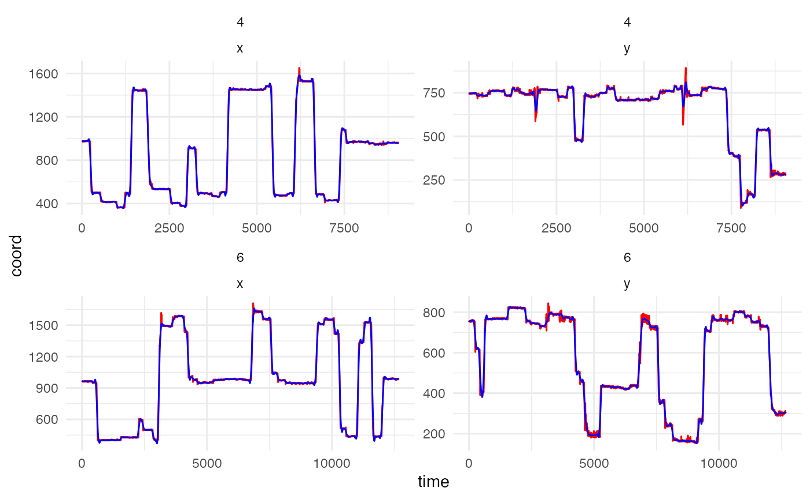

### Counterbalancing positions

Many psychology experiments will position stimuli on the screen in a
counterbalanced fashion. For example, in the example data we are using,
there are two stimuli, with one of these appearing on the left and one
on the right. In our design, one of the cue stimuli is a “target” and
one is a “distractor”, and the experiment counterbalances whether these
are positioned on the left or right across trials.

Eyetools has a built in function which allows us to transform the x (or
y) values of the stimuli to take into account a counterbalancing
variable:
[`conditional_transform()`](https://tombeesley.github.io/eyetools/reference/conditional_transform.md).
This function currently allows for a single-dimensional flip across
either the horizontal or vertical midline. It can be used on raw data or
fixation data. It requires the spatial coordinates (x, y) and a
specification of the counterbalancing variable. The result is a
normalised set of data, in which the x (and/or y) position is consistent
across counterbalanced conditions (e.g., in our example, we can
transform the data so that the target cue is always on the left). This
transformation is especially useful for future visualisations and
calculation of time on areas of interest. Note that
[`conditional_transform()`](https://tombeesley.github.io/eyetools/reference/conditional_transform.md)
is another function that does not discriminate between multi-participant
and single-participant data and so no participant_col parameter is
required.

The keen-eyed will notice that the present data does not contain a
variable to specify the counterbalanced positions. This is contained in
a separate dataset that holds the behavioural data, including the
response times, the outcome, accuracy, and `cue_order` which tells us
whether the target cue was on the left (coded as 1) or on the right
(coded as 2).

``` r

data_behavioural <- HCL_behavioural # behavioural data

head(data_behavioural)
```

    ##   pID trial P_cue NP_cue cue_order correct_out accuracy      RT
    ## 1 118     1     2      5         2           2        0 13465.0
    ## 2 118     2     2      6         2           2        0  7795.7
    ## 3 118     3     1      6         2           1        1  5266.8
    ## 4 118     4     1      5         2           1        1  9911.1
    ## 5 118     5     2      5         2           2        1  4424.2
    ## 6 118     6     2      6         2           2        1  5224.2

First we need to combine the two datasets based upon the participant
identifier. Once the data has been joined we can use
[`conditional_transform()`](https://tombeesley.github.io/eyetools/reference/conditional_transform.md)
to transform the x coordinates across the midline.

``` r

data <- merge(data_smooth, data_behavioural) # merges with the common variables pNum and trial

data <- conditional_transform(data, 
                              flip = "x", #flip across x midline
                              cond_column = "cue_order", #this column holds the counterbalance information
                              cond_values = "2",#which values in cond_column to flip
                              message = FALSE) #suppress message that would repeat "Flipping across x midline" 
```

## Fixation Detection

In this next stage, we can start to explore the functions available for
determining fixations within the data. The two main functions here are
[`fixation_dispersion()`](https://tombeesley.github.io/eyetools/reference/fixation_dispersion.md)
and
[`fixation_VTI()`](https://tombeesley.github.io/eyetools/reference/fixation_VTI.md).
Alongside these, is the option to
[`compare_algorithms()`](https://tombeesley.github.io/eyetools/reference/compare_algorithms.md)
which produces a small number of metrics and plots to help visualise the
two fixation algorithms. We will first demonstrate and explain the two
algorithms before demonstrating
[`compare_algorithms()`](https://tombeesley.github.io/eyetools/reference/compare_algorithms.md)
as this relies on the two fixation algorithms.

### Dispersion Algorithm

[`fixation_dispersion()`](https://tombeesley.github.io/eyetools/reference/fixation_dispersion.md)
detects fixations by assessing the *dispersion* of the eye position
using a method similar to that proposed by Salvucci and Goldberg
(1996)[^2]. This evaluates the maximum dispersion (distance) between x/y
coordinates across a window of data, and looks for sufficient periods in
which this maximum dispersion is below the specified dispersion
tolerance. NAs are considered breaks in the data and are not permitted
within a valid fixation period. By default, it runs the interpolation
algorithm and this can be switched off using the relevant parameter.

``` r

data_fixations_disp <- fixation_dispersion(data,
                                           min_dur = 150, # Minimum duration (in milliseconds) of period over which fixations are assessed
                                           disp_tol = 100, # Maximum tolerance (in pixels) for the dispersion of values allowed over fixation period
                                           NA_tol = 0.25, # the proportion of NAs tolerated within any window of samples evaluated as a fixation
                                           progress = FALSE) # whether to display a progress bar or not
```

The resultant data output from
[`fixation_dispersion()`](https://tombeesley.github.io/eyetools/reference/fixation_dispersion.md)
presents data by trial and fixation. It gives the start and end time for
these fixations along with their duration and the x,y coordinates for
the entry of the fixation.

``` r

head(data_fixations_disp) # show sample of output data
```

    ##   pID trial fix_n start  end duration    x   y prop_NA min_dur disp_tol
    ## 1 118     1     1     0  173      173  959 811       0     150      100
    ## 2 118     1     2   197  397      200  961 590       0     150      100
    ## 3 118     1     3   400  660      260  958 490       0     150      100
    ## 4 118     1     4   803 1040      237 1366 839       0     150      100
    ## 5 118     1     5  1233 1386      153  998 546       0     150      100
    ## 6 118     1     6  1390 1700      310  970 478       0     150      100

### VTI Algorithm

The
[`fixation_VTI()`](https://tombeesley.github.io/eyetools/reference/fixation_VTI.md)
function operates differently to
[`fixation_dispersion()`](https://tombeesley.github.io/eyetools/reference/fixation_dispersion.md).
It determines fixations by assessing the *velocity* of eye-movements,
using a method that is similar to that proposed by Salvucci & Goldberg
(1996). This applies the algorithm used in `VTI_saccade()` (detailed
below) and removes the identified saccades before assessing whether
separated fixations are outside of the dispersion tolerance. If they are
outside of this tolerance, the fixation is treated as a new fixation
regardless of the length of saccade separating them. Compared to
[`fixation_dispersion()`](https://tombeesley.github.io/eyetools/reference/fixation_dispersion.md),
[`fixation_VTI()`](https://tombeesley.github.io/eyetools/reference/fixation_VTI.md)
is more conservative in determining a fixation as smaller saccades are
discounted and the resulting data is treated as a continued fixation
(assuming it is within the pixel tolerance set by disp_tol).

In simple terms,
[`fixation_VTI()`](https://tombeesley.github.io/eyetools/reference/fixation_VTI.md)
calculates the saccades within the data and identifies fixations as
(essentially) non-saccade periods. To avoid eye gaze drift, it applies a
dispersion tolerance parameter as well to ensure that fixations can be
appropriately localised to an x,y coordinate pair. One current
limitation to
[`fixation_VTI()`](https://tombeesley.github.io/eyetools/reference/fixation_VTI.md)
that is not present in
[`fixation_dispersion()`](https://tombeesley.github.io/eyetools/reference/fixation_dispersion.md)
is the need for data to be complete with no NAs present, otherwise it
cannot compute the saccades.

The
[`fixation_VTI()`](https://tombeesley.github.io/eyetools/reference/fixation_VTI.md)
works best on unsmoothed data (with default settings), as the smoothing
process alters the velocity of the eye movement. When working with
smoothed data, lowering the default threshold parameter is recommended
as the “jerky” saccadic starts are less sudden and so the entry point of
a saccade is sooner.

``` r

data_fixations_VTI <- fixation_VTI(data,
                                   threshold = 80, #smoothed data, so use a lower threshold
                                   min_dur = 150, # Minimum duration (in milliseconds) of period over which fixations are assessed
                                   min_dur_sac = 20, # Minimum duration (in milliseconds) for saccades to be determined
                                   disp_tol = 100, # Maximum tolerance (in pixels) for the dispersion of values allowed over fixation period
                                   smooth = FALSE,
                                   progress = FALSE) # whether to display a progress bar or not, when running multiple participants 
```

``` r

head(data_fixations_VTI) # show sample of output data for participant 118
```

    ##   pID trialNumber fix_n start  end duration         x        y min_dur disp_tol
    ## 1 118           1     1     0  727      727  959.3540 598.4426     150      100
    ## 2 118           1     2   817 1150      333 1381.3137 838.8860     150      100
    ## 3 118           1     3  1243 1696      453  977.6869 499.2123     150      100
    ## 4 118           1     4  1740 2160      420  957.2454 168.2458     150      100
    ## 5 118           1     5  2280 2656      376  376.8078 833.0947     150      100
    ## 6 118           1     6  2763 3119      356  962.6908 397.8415     150      100

#### Saccades

This is also a sensible point to briefly highlight the underlying
saccade detection process. This can be accessed directly using
[`saccade_VTI()`](https://tombeesley.github.io/eyetools/reference/saccade_VTI.md).
This uses the velocity threshold algorithm from Salvucci & Goldberg
(1996) to determine saccadic eye movements. It calculates the length of
a saccade based on the velocity of the eye being above a certain
threshold.

``` r

saccades <- saccade_VTI(data)

head(saccades)
```

    ##   pID trial sac_n start   end duration  origin_x origin_y terminal_x terminal_y
    ## 1 118     1     1  2180  2243       63  847.6223 279.2320   486.8773   706.1071
    ## 2 118     1     2  2700  2750       50  558.3490 653.5044   861.8797   408.0173
    ## 3 118     1     3  3663  3736       73  936.4449 188.4667   507.2468   715.7409
    ## 4 118     1     4  4213  4283       70  461.7756 721.8442   876.6609   378.5456
    ## 5 118     1     5  5363  5386       23 1189.0907 655.7691  1312.2991   760.5734
    ## 6 118     1     6 10429 10499       70 1042.2860 216.5334  1313.9946   696.5294
    ##   mean_velocity peak_velocity
    ## 1      230.6738      351.1684
    ## 2      205.1307      283.8361
    ## 3      243.5628      349.8295
    ## 4      203.6839      288.2778
    ## 5      186.7779      230.3785
    ## 6      206.6629      282.3765

### Comparing the algorithms

As mentioned above, a supplementary function exists to compare the two
fixation algorithms, the imaginatively named
[`compare_algorithms()`](https://tombeesley.github.io/eyetools/reference/compare_algorithms.md).
To demonstrate this, we apply it against a reduced dataset of just one
participant. It takes a combination of the parameters from both the
fixation algorithms, and by default prints a summary table that is also
stored in the returned list. It is recommended to store this in an
object as the output can be quite long depending on the number of
trials.

``` r

#some functions are best with single-participant data
data_119 <- data[data$pID == 119,]

comparison <- compare_algorithms(data_119,
                                 plot_fixations = TRUE,
                                 print_summary = TRUE,
                                 threshold = 80, #lowering the default threshold produces a better result when using smoothed data
                                 min_dur = 150,
                                 min_dur_sac = 20,
                                 disp_tol = 100,
                                 NA_tol = 0.25,
                                 smooth = FALSE)
```

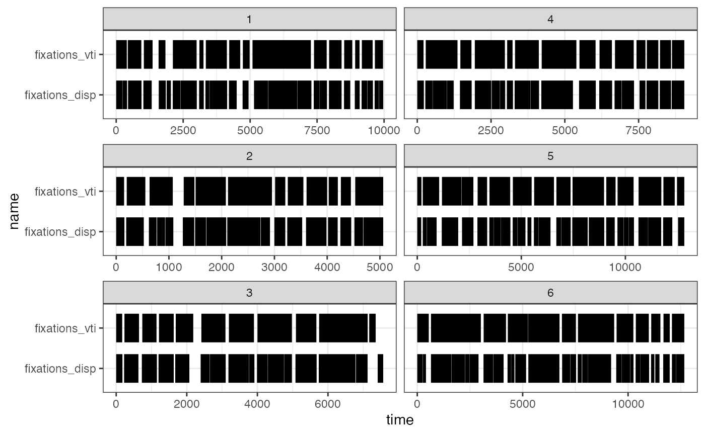

    ##     algorithm trial  percent fix_n    corr.r        corr.p   corr.t
    ## 1         vti     1 87.59843    17 0.7104866  0.000000e+00 55.72199
    ## 2  dispersion     1 83.13648    26 0.7104866  0.000000e+00 55.72199
    ## 3         vti     2 85.72368    12 0.7447970 5.618304e-269 43.48691
    ## 4  dispersion     2 86.90789    17 0.7447970 5.618304e-269 43.48691
    ## 5         vti     3 87.36240    12 0.5472060 1.402887e-177 31.14180
    ## 6  dispersion     3 82.51871    15 0.5472060 1.402887e-177 31.14180
    ## 7         vti     4 85.93520    14 0.4678127 9.038015e-148 27.57461
    ## 8  dispersion     4 87.48159    22 0.4678127 9.038015e-148 27.57461
    ## 9         vti     5 86.78265    15 0.6139684  0.000000e+00 48.25708
    ## 10 dispersion     5 84.15996    28 0.6139684  0.000000e+00 48.25708
    ## 11        vti     6 82.71962    10 0.5304694 5.191333e-275 38.57517
    ## 12 dispersion     6 86.58601    28 0.5304694 5.191333e-275 38.57517

## Areas of Interest

Once we have collected our fixation data (we will proceed using the
`fixations_disp` dataset), we can start looking at Areas of Interest
(AOIs) and then plots of the fixations.

For the `AOI_` “family” of functions, we need to specify where our AOIs
were presented on the screen. This will enable us to determine when a
participant enters or exits these areas. The best way to do this is
using the
[`create_AOI_df()`](https://tombeesley.github.io/eyetools/reference/create_AOI_df.md)
function, populating the AOI object with coordinates relevant to the
AOIs and a set of names:

``` r

# define areas of interest
a1 <- c(460, 840, 400, 300) # Left cue
a2 <- c(1460, 840, 400, 300) # Right cue
a3 <- c(960, 270, 300, 500) # outcomes

AOI_areas <- create_AOI_df(num_AOIs = 3, 
                           AOI_data = list(a1, a2, a3), 
                           AOI_names = c("left", "right", "centre"))

AOI_areas
```

    ##     name    x   y width_radius height
    ## 1   left  460 840          400    300
    ## 2  right 1460 840          400    300
    ## 3 centre  960 270          300    500

[`AOI_time()`](https://tombeesley.github.io/eyetools/reference/AOI_time.md)
analyses the total time on defined AOI regions across trials. Works with
fixation and raw data as the input (must use one or the other, not
both). This gives a cumulative total time spent for each trial.

``` r

data_AOI_time <- AOI_time(data = data_fixations_disp, 
                          data_type = "fix",
                          AOIs = AOI_areas)

head(data_AOI_time, 10)
```

    ##    pID trial   AOI time
    ## 1  118     1  left 1500
    ## 2  118     2  left 1076
    ## 3  118     3  left  733
    ## 4  118     4  left 3466
    ## 5  118     5  left 1090
    ## 6  118     6  left  879
    ## 7  118     1 right 3305
    ## 8  118     2 right 1327
    ## 9  118     3 right  569
    ## 10 118     4 right 2442

The returned data show the time in milliseconds on each area of
interest, per trial. It is also possible to specify names for the
different areas of interest. Or you can request that the function
returns the time spent in AOIs as a proportion of overall time in the
trial, which requires an input vector that has the values, luckily this
is something contained in the `HCL_behavioural` obect.

``` r

AOI_time(data = data_fixations_disp,
         data_type = "fix",
         AOIs = AOI_areas, 
         as_prop = TRUE, 
         trial_time = HCL_behavioural$RT) #vector of trial times
```

    ##    pID trial    AOI       time
    ## 1  118     1   left 0.11139993
    ## 2  118     1  right 0.24545117
    ## 3  118     1 centre 0.39762347
    ## 4  118     2   left 0.13802481
    ## 5  118     2  right 0.17022205
    ## 6  118     2 centre 0.48167580
    ## 7  118     3   left 0.13917369
    ## 8  118     3  right 0.10803524
    ## 9  118     3 centre 0.53979646
    ## 10 118     4   left 0.34970891
    ## 11 118     4  right 0.24639041
    ## 12 118     4 centre 0.23720879
    ## 13 118     5   left 0.24637223
    ## 14 118     5  right 0.05560327
    ## 15 118     5 centre 0.48053885
    ## 16 118     6   left 0.16825543
    ## 17 118     6  right 0.14987941
    ## 18 118     6 centre 0.47184258
    ## 19 119     1   left 0.15884263
    ## 20 119     1  right 0.33982876
    ## 21 119     1 centre 0.23678772
    ## 22 119     2   left 0.16408962
    ## 23 119     2  right 0.19781477
    ## 24 119     2 centre 0.39602398
    ## 25 119     3   left 0.23310485
    ## 26 119     3  right 0.27946168
    ## 27 119     3 centre 0.28831042
    ## 28 119     4   left 0.20998796
    ## 29 119     4  right 0.44538214
    ## 30 119     4 centre 0.15199549
    ## 31 119     5   left 0.25132399
    ## 32 119     5  right 0.35280374
    ## 33 119     5 centre 0.22149533
    ## 34 119     6   left 0.22017987
    ## 35 119     6  right 0.25268223
    ## 36 119     6 centre 0.35973493

As mentioned, it also works with raw data too:

``` r

AOI_time(data = data, data_type = "raw", AOIs = AOI_areas)
```

    ##    pID trial    AOI time
    ## 1  118     1   left 1670
    ## 2  118     2   left 1353
    ## 3  118     3   left  797
    ## 4  118     4   left 3733
    ## 5  118     5   left 1150
    ## 6  118     6   left  923
    ## 7  118     1  right 3680
    ## 8  118     2  right 1413
    ## 9  118     3  right  593
    ## 10 118     4  right 2530
    ## 11 118     5  right  343
    ## 12 118     6  right  817
    ## 13 118     1 centre 6017
    ## 14 118     2 centre 4163
    ## 15 118     3 centre 3063
    ## 16 118     4 centre 2880
    ## 17 118     5 centre 2357
    ## 18 118     6 centre 2743
    ## 19 119     1   left 1760
    ## 20 119     2   left  943
    ## 21 119     3   left 1990
    ## 22 119     4   left 2100
    ## 23 119     5   left 3670
    ## 24 119     6   left 3047
    ## 25 119     1  right 3733
    ## 26 119     2  right 1047
    ## 27 119     3  right 2307
    ## 28 119     4  right 4313
    ## 29 119     5  right 4917
    ## 30 119     6  right 3443
    ## 31 119     1 centre 2650
    ## 32 119     2 centre 2183
    ## 33 119     3 centre 2523
    ## 34 119     4 centre 1533
    ## 35 119     5 centre 3130
    ## 36 119     6 centre 5033

When working with raw data, you can also take advantage of
[`AOI_time_binned()`](https://tombeesley.github.io/eyetools/reference/AOI_time_binned.md),
which enables data binning based on time, and calculating time spent in
AOIs as a result. Using `bin_length`, you specify a desired length of
bin (say 100ms) and splits data into these bins, with ant remaining data
being dropped from the analysis (as it does not form a complete bin
which could skew analyses). As with
[`AOI_time()`](https://tombeesley.github.io/eyetools/reference/AOI_time.md)
you can specify either absolute or proportional time spent.

``` r

binned_time <- AOI_time_binned(data = data_119,
                               AOIs = AOI_areas, 
                               bin_length = 100,
                               max_time = 2000,
                               as_prop = TRUE)

head(binned_time)
```

    ##   pID trial bin_n left right centre
    ## 1 119     1     1    0     0   0.00
    ## 2 119     1     2    0     0   0.00
    ## 3 119     1     3    0     0   0.00
    ## 4 119     1     4    0     0   0.00
    ## 5 119     1     5    0     0   0.77
    ## 6 119     1     6    0     0   1.00

The
[`AOI_seq()`](https://tombeesley.github.io/eyetools/reference/AOI_seq.md)
function analyses the sequence of entries into defined AOI regions
across trials. This works with fixation data.

``` r

data_AOI_sequence <- AOI_seq(data_fixations_disp,
                             AOI_areas)   

head(data_AOI_sequence)
```

    ##   pID trial    AOI start  end duration entry_n
    ## 1 118     1 centre   400  660      260       1
    ## 2 118     1  right   803 1040      237       2
    ## 3 118     1 centre  1390 2116      726       3
    ## 4 118     1   left  2263 2666      403       4
    ## 5 118     1 centre  2760 3649      889       5
    ## 6 118     1   left  3743 4203      460       6

The returned data provide a list of the entries into the AOIs, across
each trial. By default the data is returned in long format, with one row
per entry.

## Plotting Functions

Finally, eyetools contains `plot_*` functions,
[`plot_seq()`](https://tombeesley.github.io/eyetools/reference/plot_seq.md)
[`plot_spatial()`](https://tombeesley.github.io/eyetools/reference/plot_spatial.md),
and
[`plot_AOI_growth()`](https://tombeesley.github.io/eyetools/reference/plot_AOI_growth.md).
These functions are not designed to accommodate multi-participant data
and work best with single trials.

[`plot_seq()`](https://tombeesley.github.io/eyetools/reference/plot_seq.md)
is a tool for visualising the timecourse of raw data over a single
trial. If data from multiple trials are present, then a single trial
will be sampled at random. Alternatively, the `trial_number` can be
specified. Data can be plotted across the whole trial, or can be split
into bins to present distinct plots for each time window.

The most simple use is to just pass it raw data:

``` r

plot_seq(data, pID_values = 119, trial_values = 1)
```

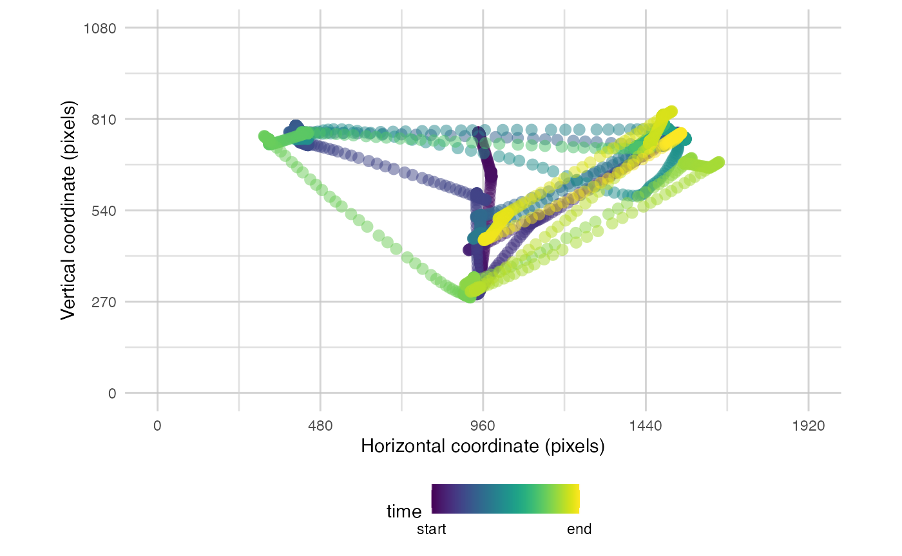

But the parameters of
[`plot_seq()`](https://tombeesley.github.io/eyetools/reference/plot_seq.md)
can help exploration be more informative. We can also add a background
image and/or the AOIs we have defined:

``` r

plot_seq(data, pID_values = 119, trial_values = 1, bg_image = "data/HCL_sample_image.png") # add background image
```

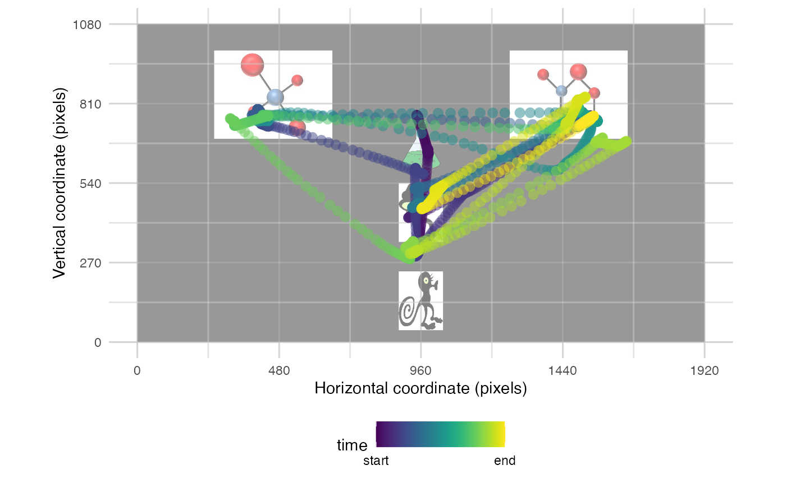

``` r

plot_seq(data, pID_values = 119, trial_values = 1, AOIs = AOI_areas) # add AOIs
```

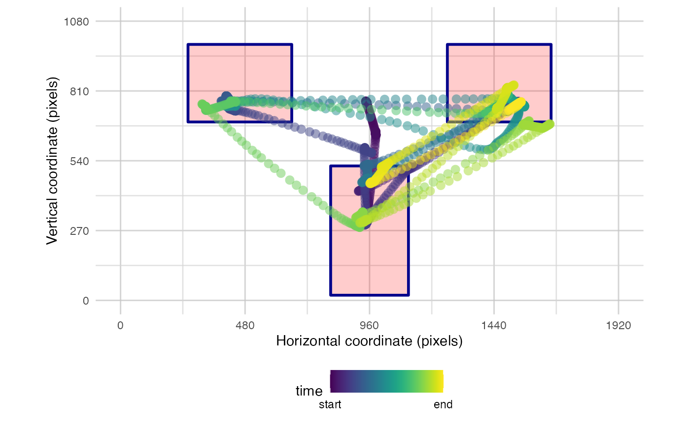

You also have the option to split the time into bins to reduce the
amount of data plotted

``` r

plot_seq(data, pID_values = 119, trial_values = 1, AOIs = AOI_areas, bin_time = 1000)
```

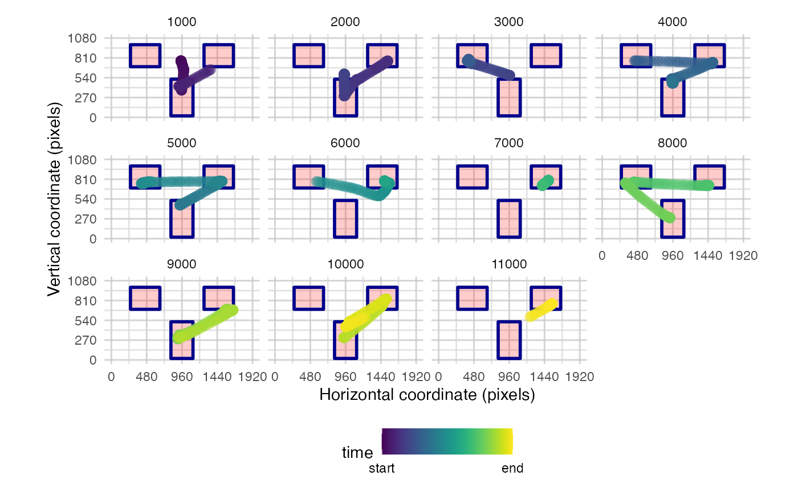

[`plot_spatial()`](https://tombeesley.github.io/eyetools/reference/plot_spatial.md)
is a tool for visualising raw eye-data, processed fixations, and
saccades. Fixations can be labeled in the order they were made. You can
also overlay areas of interest (AOIs) and customise the resolution. It
takes separate parameters for fixations, raw data, and saccades so they
can be plotted simultaneously. You can also specify the trial_number to
plot.

``` r

plot_spatial(raw_data = data, pID_values = 119, trial_values = 6)
```

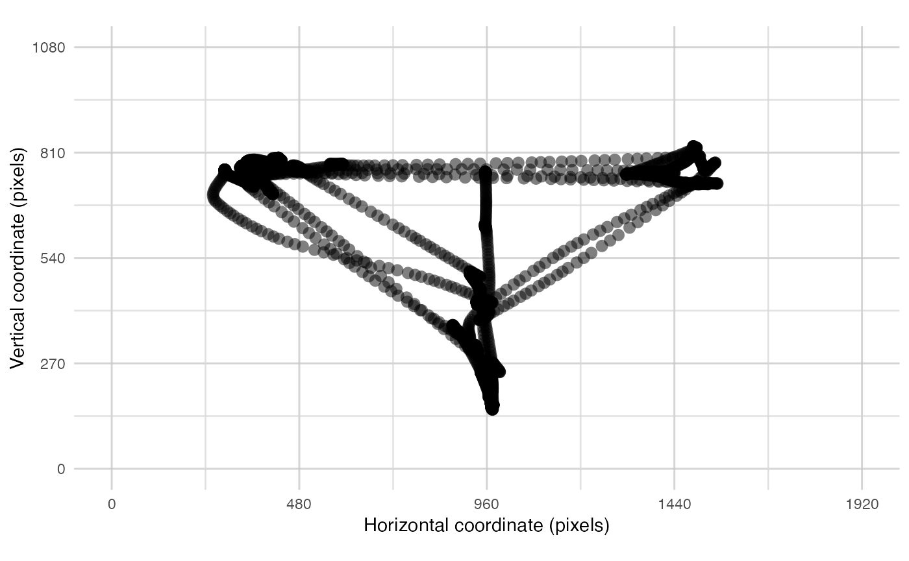

``` r

plot_spatial(fix_data = fixation_dispersion(data), pID_values = 119, trial_values = 6)
```

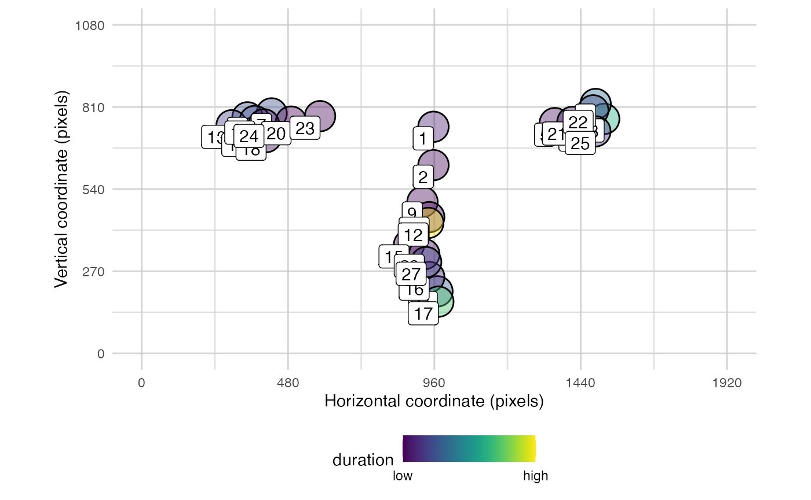

``` r

plot_spatial(sac_data = saccade_VTI(data), pID_values = 119, trial_values = 6)
```

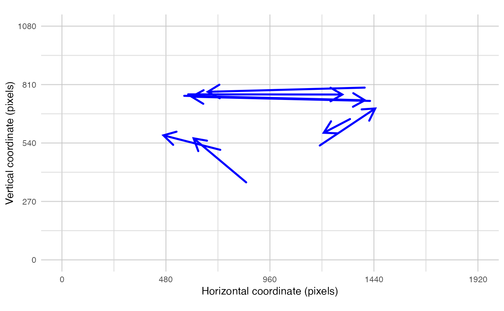

Or as mentioned, simultaneously:

``` r

plot_spatial(raw_data = data_119,
             fix_data = fixation_dispersion(data_119),
             sac_data = saccade_VTI(data_119),
             pID_values = 119, 
             trial_values = 6)
```

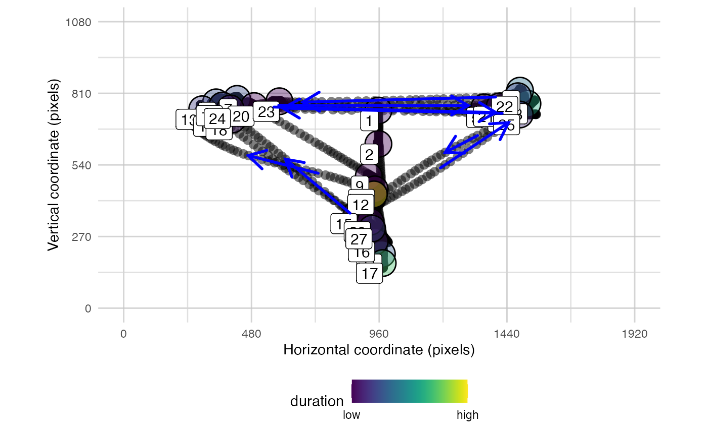

The function
[`plot_AOI_growth()`](https://tombeesley.github.io/eyetools/reference/plot_AOI_growth.md)
helps visualise how attention is directed across the development of a
trial. It presents a line graph of the change in proportion of time
spent in each AOI region across the trial time.

``` r

#standard plot with absolute time
plot_AOI_growth(data = data, 
                pID_values = 119, 
                trial_values = 1, 
                AOIs = AOI_areas, 
                type = "abs")
```

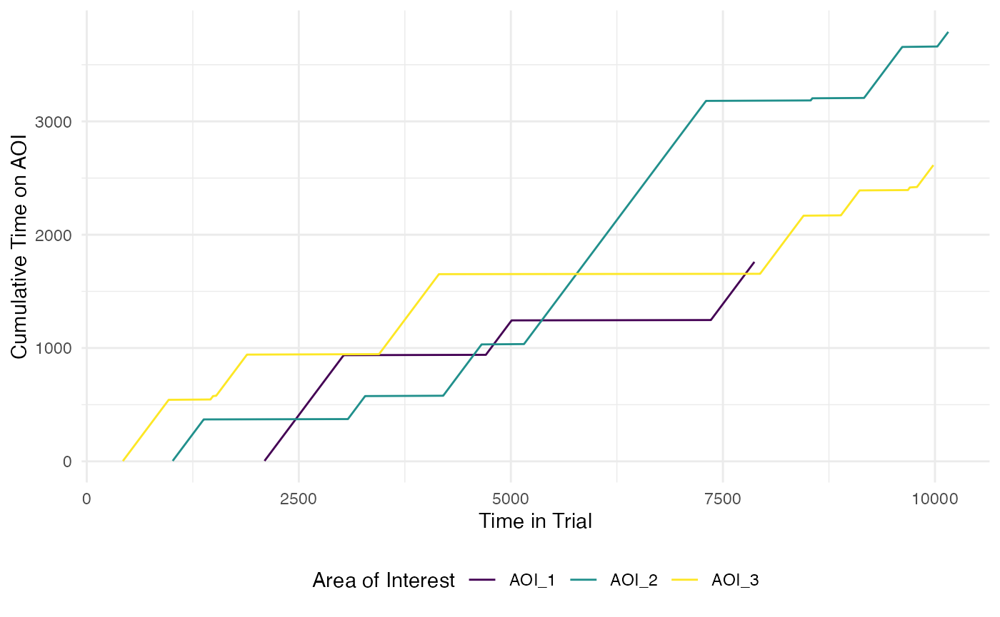

``` r

#standard plot with proportional time
plot_AOI_growth(data = data, 
                pID_values = 119, 
                trial_values = 1, 
                AOIs = AOI_areas, 
                type = "prop")
```

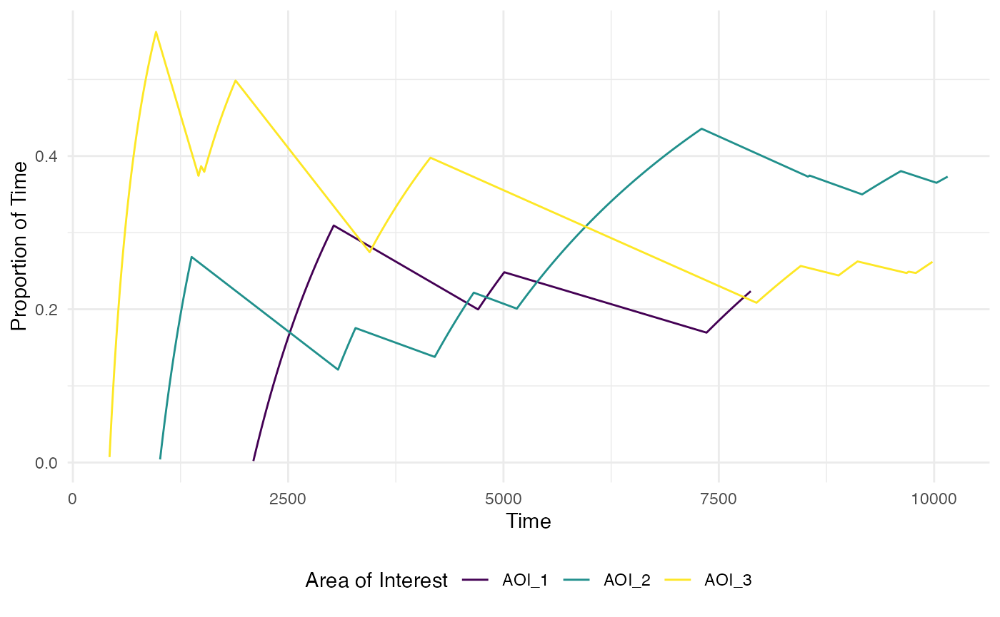

[^1]: Beesley, T., Nguyen, K. P., Pearson, D., & Le Pelley, M. E.
    (2015). Uncertainty and predictiveness determine attention to cues
    during human associative learning. Quarterly Journal of Experimental
    Psychology, 68(11), 2175-2199.

[^2]: Salvucci, D. D., & Goldberg, J. H. (2000). Identifying fixations
    and saccades in eye-tracking protocols. Proceedings of the Symposium
    on Eye Tracking Research & Applications - ETRA ’00, 71–78.
