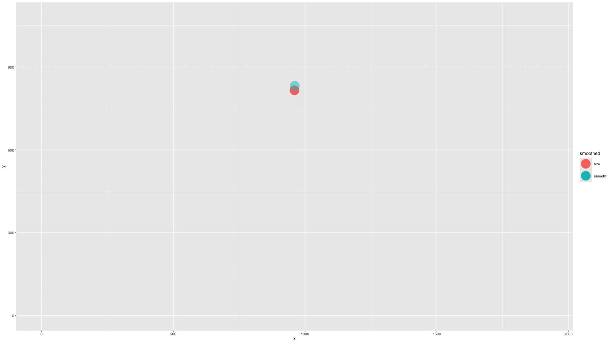
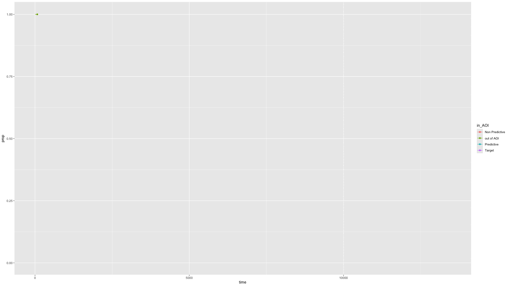
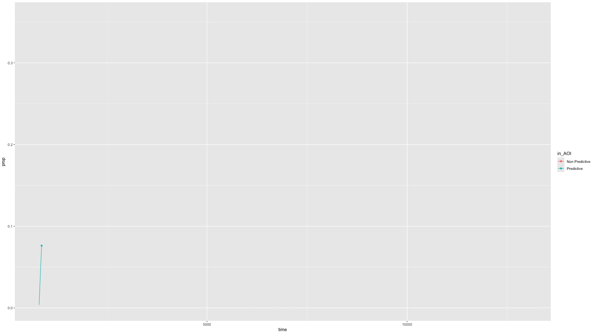

In this article, we offer examples of how eyetools data can be used with the [gganimate](https://gganimate.com/) package. This article is code heavy as it is designed to demonstrate the capacity of gganimate in tandem with eyetools and for relatively straightforward application to one's own data.

```{r, include = FALSE}
knitr::opts_chunk$set(
  collapse = TRUE,
  comment = "#>",
  warning = FALSE
)
```

```{r setup, message=FALSE, eval=FALSE}
library(eyetools)
library(gganimate)
library(tidyverse)
library(zoo)
```

```{r, eval=FALSE}
data <- combine_eyes(HCL)

data_118 <- data[data$pNum == 118,]

data_118 <- interpolate(data_118)

data_smooth <- smoother(data_118, span = .02)

data_fix <- fixation_dispersion(data_smooth)

```

## Plotting raw data with lag

Using the `plot_seq()` function we can extract the raw eye gaze and then we can create an animation using `transition_time()` and `shadow_wake()` to provide the 'lag' enabling the visualisation of the movement over the trial time.

```{r, message=FALSE, eval=FALSE}
animate1 <- plot_seq(data = data_smooth, trial_number = 1,
                     bg_image = "../data/HCL_sample_image.jpg") +
  scale_colour_gradient(low = "red", high = "red") + #to keep a consistent colour
  guides(colour="none") + #remove redundant legend when colour is consistent
  transition_time(time) + 
  shadow_wake(.125, wrap = FALSE, size = 2, alpha = .75)
```

```{r, warning=FALSE, eval=FALSE}
animate(animate1,
        duration =  15,
        end_pause = 15)

## To save an animation
#anim_save("figures/point_lag.gif", animate1, height = 810, width = 1440, duration = 12,
#          end_pause = 15)
```

```{r, echo=FALSE, fig.cap='Graphic showing the raw eye gaze data imposed over a sample stimuli image.'}
knitr::include_graphics("figures/point_lag.gif")
```

## Plotting raw and smoothed data

We can also animate the static plot presented in the `smoother()` function by plotting the x and y coordinates together. To do so, we cannot leverage the plotting function in `smoother()` as it does not play nicely with the `gganimate()` package, so we use the smoothed and unsmoothed data in a pipeline.

```{r, eval=FALSE}
data_both <- data |> 
  left_join(data_smooth, suffix = c("_raw", "_smooth"), by = join_by("pNum", "time", "trial")) |> 
  filter(pNum == "118", trial == "1") # take a single participant and trial

data_both <- data_both |> 
  pivot_longer(cols = c("x_raw", "x_smooth"), values_to = "x", names_to = "x_names") |> 
  pivot_longer(cols = c("y_raw", "y_smooth"), values_to = "y", names_to = "y_names") |> 
  filter((x_names == "x_raw" & y_names == "y_raw") | (x_names == "x_smooth" & y_names == "y_smooth")) |> 
  mutate(smoothed = str_remove(x_names, "x_"), .after = trial) |> 
  select(-c(x_names, y_names))
```

```{r, eval=FALSE}
plot_animate_smooth <- data_both |> 
  mutate(alpha = ifelse(smoothed == "smooth", .5, 1)) |> 
  ggplot(aes(x = x, y = y, colour = smoothed, fill = smoothed, alpha = alpha)) +
  geom_point(size = 10) +
  lims(x = c(0, 1920), y = c(0, 1080)) +
  scale_alpha_identity() +
  transition_components(time) +
  shadow_wake(.25, wrap = FALSE, size = 2, alpha = .75)

```

```{r, eval=FALSE}
animate(plot_animate_smooth,
        duration =  15,
        end_pause = 15)

```

```{r, include=FALSE, eval = FALSE}
# To save an animation
anim_save("figures/raw_smooth_single.gif", plot_animate_smooth, height = 810, width = 1440, duration = 15,
          end_pause = 15)
```

```{r, echo=FALSE, fig.cap='Image showing single timepoint difference between raw and smoothed data'}

```

## Plotting AOI entries

We can use `AOI_seq()` to get information about AOI entries combined with the raw data to show the gaze data entering/exiting AOIs.

```{r, eval=FALSE}

data_plot4 <- AOI_seq(data_fix, AOIs = HCL_AOIs, AOI_names = c("Predictive", "Non-Predictive", "Target")) |> 
  filter(trial == 1) |> 
  select(-c(trial, duration)) |> 
  pivot_longer(start:end, values_to = "time") |> 
  full_join(data_smooth |> 
              filter(trial == 1)) |> 
  arrange(time) |> 
  fill(AOI, entry_n, name, .direction = "down") |> 
  mutate(AOI = ifelse(name == "end", "out of AOI", AOI),
         AOI = ifelse(is.na(AOI), "out of AOI", AOI)) |> 
  mutate(AOI = factor(AOI, levels = c("Predictive", "Non-Predictive", "Target", "out of AOI")))

plot_animate_4 <- data_plot4 |> 
  ggplot(aes(x,y, colour = AOI, group = pNum)) +
  lims(x = c(0, 1920), y = c(0, 1080)) +
  #add a background image
  annotation_raster(magick::image_read("../data/HCL_sample_image.jpg"),
                    xmin = 0,
                    xmax = 1920,
                    ymin = 0,
                    ymax = 1080) +
  geom_point(size = 5) +
  transition_components(time)

```

```{r, eval=FALSE}
animate(plot_animate_4, 
        duration = round(max(data_plot4$time)/1000))
```

```{r, include=FALSE, eval = FALSE}
# To save an animation
anim_save("figures/AOI_entry.gif", plot_animate_4, height = 810, width = 1440, duration = round(max(data_plot4$time)/1000),
          end_pause = 5)
```

```{r, echo=FALSE, fig.cap='Image showing lagged timepoint difference between raw and smoothed data'}
knitr::include_graphics("figures/AOI_entry.gif")
```

## Plotting time spent in Areas of Interest over time

```{r, eval=FALSE}
growth_all <- data_smooth |> 
  filter(pNum == "118", trial == "1") |> 
  plot_AOI_growth(AOIs = HCL_AOIs, AOI_names = c("Predictive", "Non Predictive", "Target")) +
  geom_point() + 
  transition_reveal(time)
```

```{r, eval=FALSE}
animate(growth_all, 
        duration = 10)
```

```{r, include=FALSE, eval = FALSE}
# To save an animation
anim_save("figures/data_growth_all.gif", growth_all, height = 810, width = 1440, duration = 10,
          end_pause = 5)
```

```{r, echo=FALSE, fig.cap='Image showing the proportion of time spent in an AOI over time'}

```


### Or just predictive and non-predictive cues

This is easily done by specifying NAs in the appropriate position in the `AOI_names` parameter.

```{r, eval=FALSE}

growth_partial <- data_smooth |> 
  filter(pNum == "118", trial == "1") |> 
  plot_AOI_growth(AOIs = HCL_AOIs, type = "prop", AOI_names = c("Predictive", "Non Predictive", NA)) +
  geom_point() + 
  transition_reveal(time)

```

```{r, eval=FALSE}
animate(growth_partial, 
        duration = 10)
```

```{r, include=FALSE, eval = FALSE}
# To save an animation
anim_save("figures/data_growth_partial.gif", growth_partial, height = 810, width = 1440, duration = 10,
          end_pause = 5)
```

```{r, echo=FALSE, fig.cap='Image showing the proportion of time spent in an AOI over time'}

```
